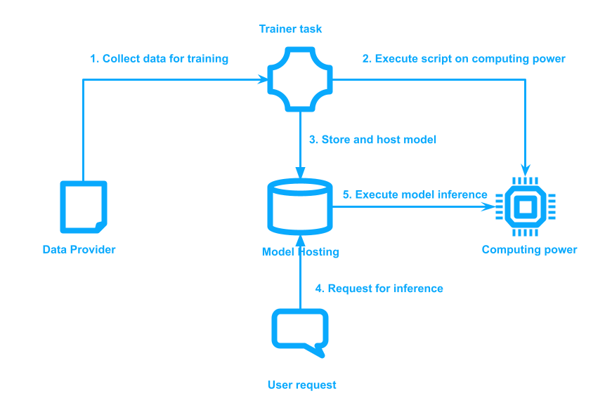

# Landscape

<figure><figcaption>
Workflow of Deep Learning Paradigm
</figcaption></figure>

The figure illustrates a simplified yet characteristic workflow of the deep learning model paradigm:

1. Data providers contribute data for training purposes. \item Model training scripts are executed on computing resources.
2. Upon model convergence, the model is stored and hosted at a specified location.
3. Users submit input requests to utilize the model. \item The model host conducts model inference on computing resources and delivers the results to the user.&#x20;

In a centralized AI scenario, the entity conducting the model training task typically centralizes and stores all data internally, thereby assuming responsibility for data storage, infrastructure procurement (either through ownership or rental), as well as model training, hosting, and inference functionalities. This centralized model not only consolidates control but also raises concerns regarding data privacy and security, as well as potential biases inherent in the centralized decision-making process.

Contrastingly, in a fully decentralized AI setting, each of these participants—data providers, model trainers, and infrastructure owners—operates within distinct entities. This decentralized structure aims to distribute control and responsibility across a broader network of stakeholders, thereby mitigating the risks associated with centralization, such as monopolization and single points of failure. However, the lack of trust between parties in a decentralized environment poses its own set of challenges, including the need for robust mechanisms for data sharing, model training, and inference coordination while ensuring data privacy, security, and fairness.

This shift towards decentralization in AI research is motivated by the desire to foster transparency, accountability, and inclusivity in the development and deployment of AI systems. By distributing control and ownership of AI resources among diverse stakeholders, decentralized AI endeavors to democratize access to AI technologies and empower individuals and communities to actively participate in shaping the future of AI. Nonetheless, realizing the full potential of decentralized AI requires overcoming various technical, organizational, and regulatory challenges, as well as establishing trust and collaboration among stakeholders.

### Disambiguation

It's essential to clarify the scope of Decentralized AI (DeAI) within this survey. In this survey, we only focus on challenges and solutions from decentralized settings for deep learning model training and inference.

While the term "decentralized AI" is sometimes used to describe multi-agent systems \cite{demazeau1990decentralized, miiller1990decentralized}, this survey specifically focuses on the decentralized training and inference processes involving participants contributing data, computing power, and training scripts.

Furthermore, while many decentralized AI technologies utilize distributed computing techniques, such as data parallelism and model parallelism\cite{verbraeken2020survey}, distribution alone does not guarantee decentralization. These distribution techniques typically rely on implicit trust between nodes within a centralized setting. Decentralization, in addition to distribution, requires the establishment of trust mechanisms to prevent malicious attacks and incentive mechanisms to foster high-quality engagement and network improvement.
